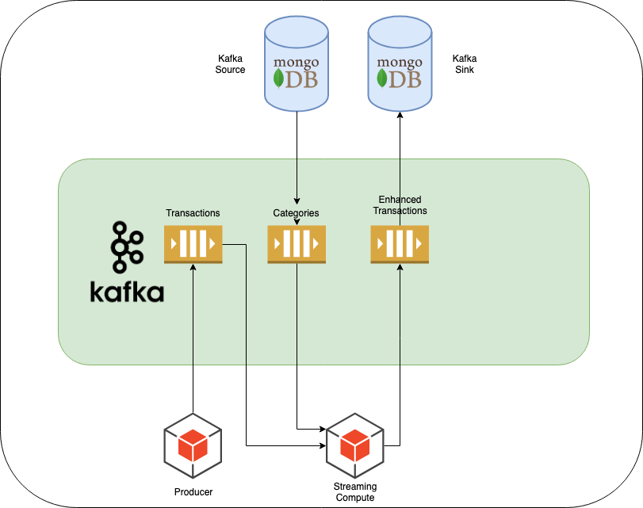

# Kafka Transactions

## Broad Architecture



## Problem statement

We want to create a streaming application that will make use of some simple account transaction messages.

```json
{
  "customer": "Bob",
  "amount": 64,
  "category": "CG01",
  "occurred": 1567148940000  
}
```

Broadly we will perform the following tasks:
* Calculate the total for each customer.
* Calculate the total for a month for each customer
* Enrich the transaction data with another source.

To do this we will use 5 topics, 2 input and 3 output:

| Topic                        | Type | Key    | Value  |
| ---------------------------- |--------| -------|---|
| transactions-topic           | Input | String | json (String) |
| category-topic               | Input | String |   String |
| customer-total-topic         | Output | String |   Long |
| customer-rolling-total-topic | Output |String |   Long |
| enhanced-transactions-topic  | Output | String | json (String) |

We do not need to tell Kafka what it will be storing when we create the topics, but we do need to tell
our `Producer` and `Streaming Application` how to serialize and deserialize these values.

### The Producer

Ultimately we will be writing transactions to a topic `transactions-topic` in json format. Have a bit of a think
about what key we should use!


We will be following kafka's exactly-once semantics, read about it here: https://www.confluent.io/blog/exactly-once-semantics-are-possible-heres-how-apache-kafka-does-it/

The producer will have access to a `LegacyBankingSystem` that will provide you with 
transactions to be published, so don't worry about generating this data yourself.

### Calculating a customers balance

We will then create a streaming topology that can handle these events. We will then 
aggregate a customers balance and write this back to another topic - for this we will use a 
`compacted` topic: https://kafka.apache.org/documentation/#compaction

If we were to see the following events to the `transactions-topic`:
```json
[{
  "customer": "Bob",
  "amount": 64,
  "category": "CG01",
  "occurred": 1567148940000  
},
{
  "customer": "Bob",
  "amount": 64,
  "category": "CG01",
  "occurred": 1567148940000  
},
{
  "customer": "Alice",
  "amount": 64,
  "category": "CG01",
  "occurred": 1567148940000  
}]
```

How many records should be in the `customer-total-topic`? And what should their values be?


### Calculating the last 30 day spend.

We will use the same topology to create another view of the data - the total spend over the 
last 30 days (so the balance will reset to 0 after 30 days)

Again we will look to use a Compacted topic here.


### Enriching transaction data.

You might notice that there is a `category` code embedded into each transaction record. Not very useful huh?
Let's use a GlobalKTable to allow us to reference data sourced from the `category-topic` to enrich out transactions.
If there is no corresponding value for a category, we will retain the code value. 

https://docs.confluent.io/current/streams/concepts.html#streams-concepts-ktable


## Scripts to help

Let's have a look at `create-topics.sh` file for more details... 


## Starting our environment

We will be using docker to handle our setup. Open up `docker/docker-compose.yml` to see what we are building.
* Mongo Database (for sink and source)
* Mongo Client (so we can easily view the mongos)
* Zookeeper
* Kafka Broker
* Kafka Connect Cluster
* Kafka Control Center

We will be using all of these tools to make our way through the course.

### Starting the environment

We will use docker-compose to start everything. From the root of the project run the following command.
This can take some time.. Notice that we only have a single broker so we will not be working with any ISR's 
(this is mainly to save your local compute :)

```shell script
docker-compose -f docker/docker-compose.yml up -d
```

This may take some time, so see if you can hit the control center at http://localhost:9021

### Create the topics

Now that you have validated that the control center is up, it is time to create some topics!
We have added yet another docker file to help use here - this one is an image that has all of the kafka tools installed
and ready to go.

To run it execute the following
```shell script
docker-compose -f docker/docker-compose.tools.yml run kafka-tools
```

We now have access to all of the kafka cli tools without the need to install locally.

Open up `create-topics.sh` in the root of this project and paste the commands into your terminal.

Again, notice that the replication factor for all of these topics are set to 1, because we only have 1 broker!

## Create a producer!

Ok great, now we are have an environment set up and ready to roll.
The first thing we want to do is to be able to publish messages onto a topic. Let's go over the project structure
and have a go.

We can see any new data appear on the topic by creating a Console Producer from within our docker-tools command prompt like this:
```shell script
 ./bin/kafka-console-consumer.sh --bootstrap-server broker:29092 \
             --topic transaction-topic \
             --from-beginning \
             --formatter kafka.tools.DefaultMessageFormatter \
             --property print.key=true \
             --property print.value=true
```

To see a working version of the producer you can checkout the branch called `producer-complete`.

## Kafka Connect Sink!

Next steps

